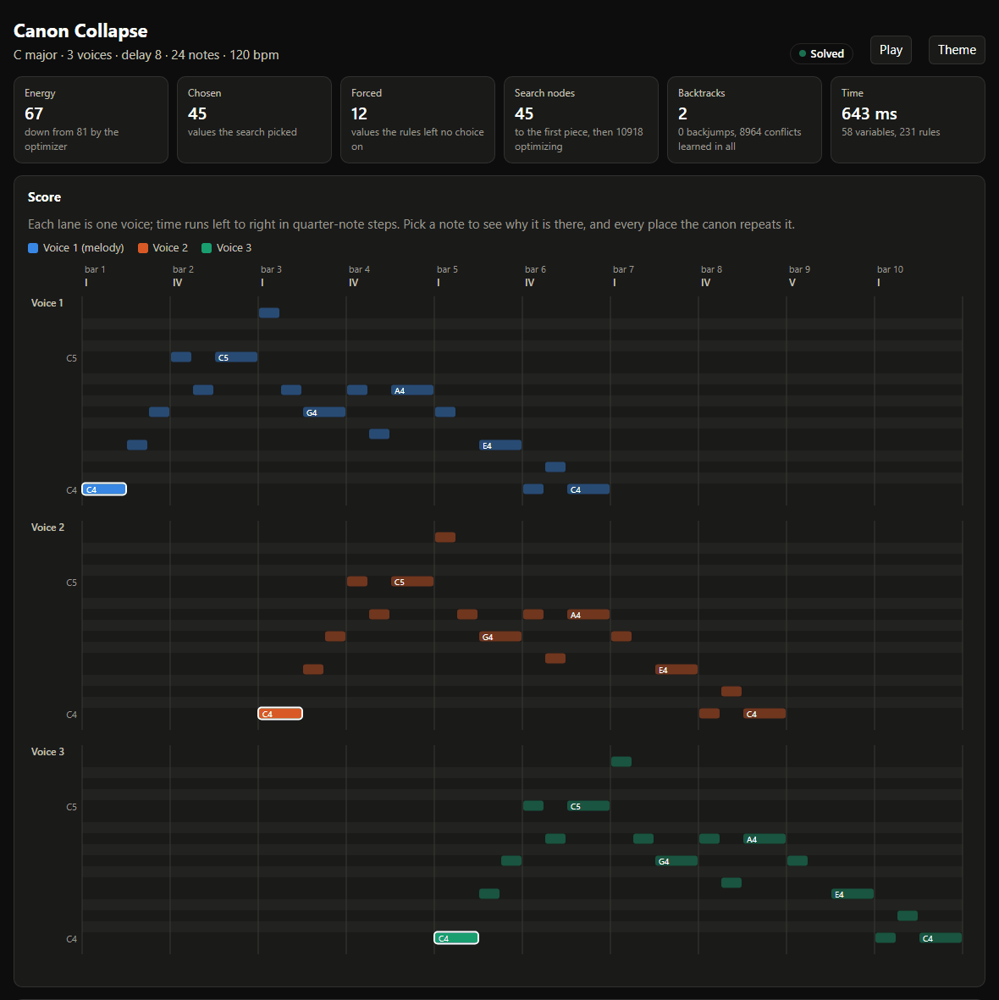
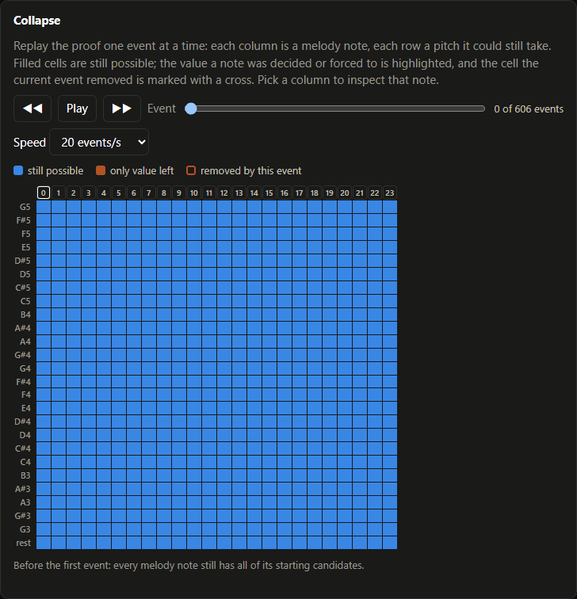
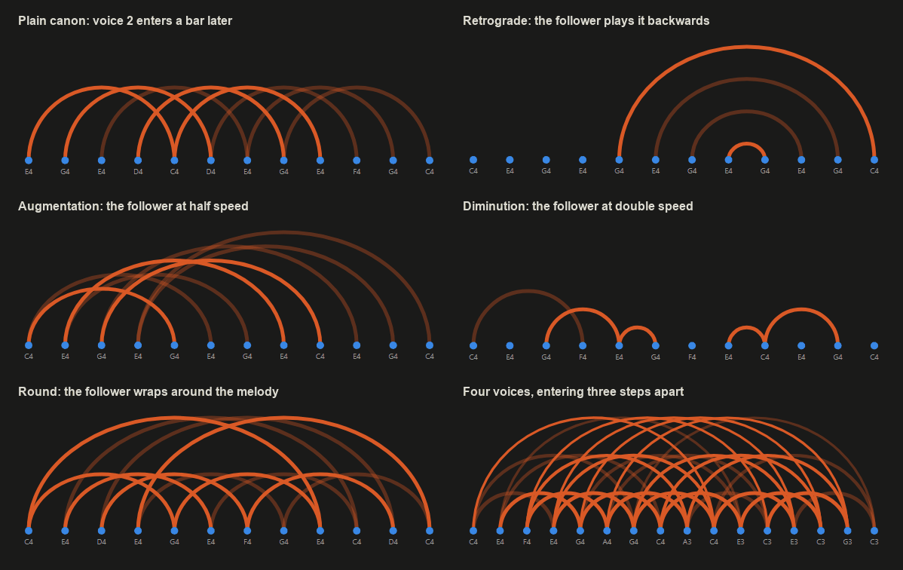

# Canon Collapse

[](https://github.com/DevomB/godels-fugue/actions/workflows/ci.yml)
[](https://github.com/DevomB/godels-fugue/releases/latest)
[](LICENSE)

Canon Collapse writes canons, pieces where one melody is played against delayed
copies of itself, by solving them as a constraint problem, and it can tell you why
every note is there.

**[Try it in your browser](https://devomb.github.io/godels-fugue/)**: the same C
program compiled to WebAssembly. Pick a piece, press Compose, and listen. Click any note
to see the rules that put it there, or give it another pitch and hear the piece
re-compose around your choice (or learn which rule forbids it). The demo also shows the
canon as sheet music, replays the collapse, and gives every piece a link you can share.



Each melody note starts with every pitch in range. Musical rules (stay in the key,
no large leaps, consonant strong beats, no parallel fifths, end with a cadence) remove
pitches that can't work. Because each note is heard again in the other voices, one
choice ripples through the whole piece. When no rule removes anything more, the solver
chooses a note and propagation continues, until every note has collapsed to a single
pitch. Every removal is recorded with the rule that caused it and the facts it relied
on. That record answers "why is this note here?" for any note in the finished piece.

It is written in C11 with no dependencies and writes MIDI, MusicXML, LilyPond, ABC,
WAV, an SVG contour, a proof trace, and an interactive HTML score.

## Install

Download an archive for Linux (x86_64, static), macOS (universal) or Windows (x86_64)
from the [latest release](https://github.com/DevomB/godels-fugue/releases/latest).
Each one holds the `canon-collapse` program, the examples and the docs. Or build it
yourself with a C11 compiler and CMake:

```sh
cmake -S . -B build
cmake --build build
```

## Quick start

```sh
./build/canon-collapse
```

```text
key: C major
melody: 64 67 64 62 60 62 64 67 64 65 67 60
voice 2: rest rest rest rest 64 67 64 62 60 62 64 67 64 65 67 60
backtracks: 0
search: 13 nodes, 12 decisions, 0 backjumps, 0 learned
optimize: energy 27 -> 24, 1 improvement in 6 windows and 3644 more nodes, no window improves it
entropy: 0.000000
energy: 24 (gravity 9, curve 12, leap 1, dissonance 2)
```

Pitches are MIDI numbers (60 is middle C). Open `output/score.html` in a browser to
see and hear the piece, and click any note to see why it is there.

Ask the command line directly with `--explain`:

```sh
./build/canon-collapse --config examples/cyclic.txt --explain x8
```

```text
x8 = E4 (pitch of melody note 8)
  heard: voice 1 step 8, voice 2 step 0
  forced by propagation: every other value was removed
  removed:
    C4 D4 F4 B4 consonance: voices 1,2 must be consonant at step 0 (bar 1) (with x0 = C4)
    C#4 D#4 F#4 G#4 A#4 scale: notes stay in the key (with key = C major)
    G4 A4 C5 consonance: voices 1,2 must be consonant at step 8 (bar 3) (with x4 = G4)
  depends on: x0 = C4, x4 = G4
```

In this round, voice 2 plays note 8 at the very start, against the melody's C4, and
again at step 8 against its G4. Only E4 is consonant with both. Those two decisions
are all it depends on: propagating from them alone forces E4, and neither does it
without the other. A note the search chose instead of one that was forced lists the
candidates it weighed and what each one cost.

When the rules can't all hold, the program says which ones clash:

```sh
./build/canon-collapse --config examples/unsat.txt
```

```text
core: cadence
unsat: no melody satisfies every rule; x4 has no value left
last removal: x4 C4 by consonance: voices 1,2 must be consonant at step 4 (bar 2) (with x0 = C4)
```

## What it can do

- **Canons of 2 to 4 voices**, each with its own entry point, optionally transposed
  (by one amount or by a different one per voice, in semitones or in scale steps of the
  key so a canon at the third stays in the key), inverted (mirrored), retrograde
  (backwards), augmented, diminished, phase-shifted, or cyclic (a round that loops).
- **Keys and modes**: major, minor, and the church modes. The key can be fixed or left
  to the solver, and the piece can modulate to a named key or to any closely related
  key. The modulation happens at the same step in every voice.
- **Harmony**: optional chord variables, one per bar, with chord tones on strong beats
  and the usual root progressions.
- **Rhythm**: optional ties (half, dotted half and whole notes) and rests, with rules
  against over-long notes and costs for syncopation and plain runs of quarter notes.
- **Rules you can turn on or off**: consonance, parallel fifths and octaves, maximum
  leap, voice spacing and crossing, cadence, leading tones rising to the tonic
  (`leading_tone`), no two large leaps in a row in one direction (`double_leaps 0`),
  and a mirror melody that is its own retrograde inversion (it sounds the same
  backwards and upside down).
- **Given notes**: fix any notes of the melody and the solver completes the rest, or
  give the whole melody, typed in or read from a MIDI file, to check it against the
  rules and see what it costs.
- **Soft preferences** that rank the legal choices: stable scale degrees, a tension
  curve you draw (an arch unless you give one), small leaps, few repeated notes,
  recovering after a leap, a repeating motif, contrary rather than similar motion
  between voices (`w_contrary`), pitch-class weights learned from a corpus, and more.
  Their sum is the piece's *energy*.
- **Search** with minimum-remaining-values, entropy or look-ahead variable ordering,
  conflict-directed backjumping, learned conflicts, node and time limits, and a
  neighbourhood optimizer that lowers the energy after the first solution.
- **Explanations**: a proof log of every removal with its parent events, the decisions
  each forced value rests on (a minimal set whenever propagation from them forces it:
  dropping any one leaves the value unforced; a set left whole, because propagation
  alone does not force the value or a very large piece ran out of budget, is marked
  "full reason, not minimized"), an unsat core for impossible rule sets, and a
  counterfactual for given notes.
- **Style presets**: `renaissance`, `baroque`, `classical`, `minimalist`,
  `experimental`.
- **A SAT cross-check** (`--sat`) that encodes the same rules for a separate DPLL
  solver.
- **Counting and sensitivity** (`--count`, `--sensitivity`): how many pieces the
  rules allow, and which melody notes are frozen or open.

## Configuring a piece

A config file holds one `key value` pair per line; `#` starts a comment:

```text
# three voices in D minor with chords
voices 3
key D
mode minor
harmony 1
rhythm 1
range_low 55
range_high 79
```

JSON works too, and so does starting from a preset:

```json
{ "preset": "baroque", "key": "D", "length": 20, "tempo": 96 }
```

```sh
./build/canon-collapse --config piece.txt
./build/canon-collapse --config examples/baroque.json
./build/canon-collapse --preset minimalist --set tempo=140
```

Settings apply in order: the defaults, then `--preset`, then the config file (whose own
`preset` key applies before its other keys), then each `--set KEY=VALUE`, then
`--melody-midi` and `--lock`.
**[docs/config.md](docs/config.md) lists every key** with its default, range and
meaning; `canon-collapse --list-config` prints the same list.

The keys you are most likely to change:

| Key | Default | What it does |
| --- | --- | --- |
| `length` | 12 | Melody notes, up to 64 (one step each; four steps make a bar) |
| `voices` | 2 | Number of voices |
| `delay` | 4 | Steps between voice entries |
| `key`, `mode` | C, major | The key; `search` lets the solver choose |
| `range_low`, `range_high` | 60, 72 | Lowest and highest MIDI pitch any voice may sound |
| `invert`, `retrograde`, `transpose` | off | Canon transforms for the followers |
| `harmony`, `rhythm` | off | Chord variables; ties and rests |
| `cadence` | on | End on the tonic, approached from the dominant |
| `consonance` | strong | `off`, `strong` beats, or `all` steps |
| `max_spacing`, `crossing` | off, allowed | Widest interval between voices; whether a later voice may sound above an earlier one |
| `melody` | all free | The notes to keep, `?` for the ones to choose |
| `optimize` | 10000 | Nodes spent lowering the energy after the first solution |
| `seed`, `temperature` | 1, 0 | Sampling instead of always taking the cheapest value |
| `tempo`, `instrument` | 120, pluck | Quarter notes per minute; the sound of `voices.wav`: `pluck`, `organ` or `sine` |

The `examples/` directory has a config for each feature. Each file starts with a
comment saying what it shows.

### Starting from a melody

`melody` fixes the notes you give and leaves the solver the ones marked `?`:

```text
length 12
melody 64 67 69 67 ? ? ? ? ? ? ? 60
```

```text
melody: 64 67 69 67 71 67 65 64 67 64 62 60
counterfactual: given x0 = E4, x1 = G4, x2 = A4, x3 = G4, x11 = C4
changed: 2 3 4 5 6 7 8 9 10
```

The solver completes the canon around the given notes, and `changed` lists the notes
that differ from the piece it would have written on its own. Give every note to check a
finished melody: a run that solves reports its energy, and one that fails names the
rules the melody breaks.

`--melody-midi FILE` gives every note from a Standard MIDI file instead, and sets
`length` to fit: it reads the first track with notes at one step per quarter note,
takes the highest note where notes overlap, and rests where none sounds (rests need
`rhythm 1`).

`--check` judges the given notes without a search and writes no files, so it refuses
`--count`, `--sensitivity`, `--sat`, `--explain` and `--corpus`. A rule on a given
note is broken when no values of its `?` notes (and ties) could satisfy it, and each
broken one is named with the given notes involved (exit 1):

```text
$ canon-collapse --set melody=60,61,?,?,62 --check
violation: scale: notes stay in the key (x1 = C#4, key = C major)
violation: consonance: voices 1,2 must be consonant at step 4 (bar 2) (x4 = D4, x0 = C4)
```

A failed run prints the same lines before its `core:` line, and adds them to
`report.txt` and `proof.json`. `examples/check.txt` gives a whole melody to check.

## Output files

Every run writes these next to `--out` (default `output/canon.mid`):

| File | Contents |
| --- | --- |
| `canon.mid` | Standard MIDI file: a tempo, meter and key-signature track, then one track per voice |
| `score.musicxml` | MusicXML 3.1 for notation software, with ties across barlines and key changes |
| `score.ly` | LilyPond source: one staff per voice in a staff group, the same spelling, ties, clefs and key changes |
| `score.abc` | ABC notation: one voice per canon voice, with accidentals written out relative to the key signature |
| `voices.wav` | Stereo, 16-bit, 44.1 kHz: the voices on a plucked string, or the organ or sine that `instrument` picks, panned from left to right in a small reverb that rings on for 1.5 s after the last note |
| `contour.svg` | Pitch over time for every voice |
| `score.html` | Interactive score: a plain-words summary of how the piece collapsed, piano roll per voice, playback (harpsichord, organ or sine, each voice panned in stereo, notes lighting up as they sound, looping for rounds, any voice muted from the legend), why each note is there, the canon's fingerprint (which notes sound against which), a step-by-step replay of the collapse (every melody note's remaining candidates at any proof event, synced to the entropy chart, with each note plucked as the solver decides it), what the given notes changed, entropy and energy charts, and the proof log |
| `explain.txt` | The explanation for every variable, as `--explain` prints it |
| `report.txt` | Keys, search statistics, energy by rule, values removed by each rule, the unsat core, the rules given notes break, and every config key used |
| `proof.txt` | Every proof event in order: removals, decisions, forced collapses, and entropy after each round of propagation |
| `proof.dag` | Each proof event with the events and assignments it rests on |
| `proof.json` | The whole piece as JSON: config, score, each variable's explanation, events with their parents, and statistics |
| `entropy.txt` | Remaining entropy in bits after each round of propagation |

`--proof` and `--entropy` move the proof and entropy files; `proof.dag` and
`proof.json` follow `--proof`. A run that finds no piece still writes the proof files,
`report.txt`, `explain.txt` and `score.html`.

## Command line

```text
canon-collapse [options]
  --config FILE        load keys from FILE (text, or JSON if the name ends in .json)
  --preset NAME        apply a style preset before the config file
  --set KEY=VALUE      override one key after the config file (repeatable)
  --lock INDEX PITCH   fix melody note INDEX to MIDI PITCH and report what changed
  --melody-midi FILE   take the melody and its length from a MIDI file
  --explain VAR        print why a variable has its value: 5, x5, tie5, chord2, key, key2
  --check              only check the given notes against the rules: print each broken
                       rule, or "violations: none" (exit 1 if any)
  --out FILE           MIDI path; the other score files go beside it
  --proof FILE         proof trace path (default output/proof.txt)
  --entropy FILE       entropy log path (default output/entropy.txt)
  --corpus DIR         suggest pitch-class weights from files of MIDI pitches and .mid files
  --apply-weights      use the suggested corpus weights
  --sat                check the rules with the SAT backend instead
  --count N            count the pieces the rules allow, up to N
  --sensitivity        for each melody note, the values a piece can give it
  --max-nodes N        give up after N search nodes (0 = no limit)
  --time-limit MS      give up after MS milliseconds (0 = no limit)
  --list-config        print every config key (--markdown for a table)
  --list-presets       print the style presets
  --version            print the version
```

Exit status: 0 solved, 1 unsatisfiable or bad input, 2 too large for `--sat`, 3 search
limit reached. `--count` and `--sensitivity` exit 0 with an answer, even "no pieces",
and 3 when the search limit cut them short. `--explain` needs a solved piece, so it
refuses `--count`, `--sensitivity` and `--sat`.

## How it works

The config becomes a **model**: variables (one pitch per melody note, plus a tie per
note with `rhythm`, a chord per bar with `harmony`, and a key per section) and two
lists over them. **Constraints** are the hard rules. Each one covers only the few
variables it involves: the consonance rule at step 8 covers the notes each voice
sounds there, and a parallel-fifths rule covers four notes. **Terms** are the soft
costs, built the same way. Because the canon mapping (which melody note each voice
plays at each step) is built into the model, every rule sees the voices exactly as
they sound, whatever the transforms.

The solver keeps every variable's remaining values in a 128-bit set. It removes each
value that no longer has a supporting combination of neighbouring values (generalized
arc consistency), and records every removal. When nothing more can be removed, it picks
a variable (fewest values left by default) and tries its values from cheapest to
dearest. A dead end is traced back to the decisions it depends on: the search jumps
straight back to the latest of those, and remembers the combination so it never tries
it again. After the first solution, the optimizer re-solves six-note windows for a
lower total energy, then replays the best piece so the proof describes it.

The Collapse card in `score.html` replays that proof. Each column is a melody note and
each row a pitch it could still take; decisions and forced values turn orange, and
every removal is marked as it happens:



Which notes constrain each other depends on the canon's shape: two melody notes are
tied together wherever the voices sound them at the same time. `score.html` draws that
as the canon's fingerprint, an arc for every pair of notes heard together, so each
transform has its own picture:



[docs/design.md](docs/design.md) covers the ideas behind the project and which of
them are built.

### Counting and sensitivity

`--count N` enumerates pieces with the same search: each complete piece is counted and
then treated as a dead end on every decision, so backjumping and learned conflicts
stay sound and only exclude pieces already counted. It prints `count: 160 (exact)`,
or `count: at least 1000 (stopped at 1000)` when it reached N, or `(stopped at the
search limit)` when `max_nodes` or `time_limit` ran out first.

`--sensitivity` takes every melody note's values after the first propagation and
solves once with the note fixed to each. A note with one viable value is **frozen**,
one with several is a **bifurcation point**, and one with none means the rules have
no piece at all; a value whose solve hits the search limit is listed as unknown.

```text
$ canon-collapse --config examples/sensitivity.txt --count 1000 --sensitivity
count: 160 (exact)
nodes: 259
note  verdict            viable values
x0    bifurcation point  4/4: C4 D4 E4 G4
...
x6    bifurcation point  2/2: D4 G4
x7    frozen             1/1: C4
```

Both use the config's fixed delay (not `delay_search`), skip the optimizer and write
no files.

## Building and testing

You need a C11 compiler and CMake 3.16 or newer. The build is warning-free with GCC,
Clang and MSVC (`/W4`).

```sh
cmake -S . -B build                 # Linux, macOS, or Windows with MinGW
cmake --build build
cd build && ctest
```

On Windows with Visual Studio, from a Developer Command Prompt:

```bat
cmake -S . -B build -G "NMake Makefiles"
cmake --build build
cd build && ctest
```

The tests cover the theory functions, config and JSON parsing, the canon mapping,
every rule's propagation, the solver (backjumping, learning, limits, unsat cores, the
optimizer), explanations, every exporter, and the command line end to end. A
property test solves hundreds of random configurations, checks each piece with a
separate rule checker, and checks that the SAT backend agrees on which ones can be
solved.

### The web demo

`web/` holds the browser page. With [Emscripten](https://emscripten.org) installed,
build the WebAssembly program and serve the page beside it:

```sh
emcmake cmake -S . -B build-web
cmake --build build-web
mkdir -p site/examples
cp web/* build-web/canon-collapse.js build-web/canon-collapse.wasm site/
cp examples/*.txt examples/*.json site/examples/
python -m http.server --directory site
```

`node tests/web_smoke.mjs build-web examples` runs the WebAssembly program the way the
page does and checks its output; CI runs it on every push and before each deploy.

The page runs `main()` in a web worker with the config written to an in-memory file
system and reads the output files back, so it composes exactly what the command line
does. On top of `score.html` it adds:

- **What if?** The inspector offers every other value of a melody note. Picking one
  writes it into the config's `melody` line and composes again; the page outlines the
  notes that changed to fit in every voice, or names the rule the value breaks, and can
  undo.
- **Shape the piece**: drag the tension curve's points and move sliders for following
  it, smooth lines, consonance, contrary motion and tempo; each change writes the
  matching config line (`tension`, `w_curve`, `w_leap`, `w_dissonance`, `w_contrary`,
  `tempo`) and composes again.
- **Surprise me** rolls a new kind of piece: two or three voices, a random key and mode,
  an entry delay, a tension curve and a tempo, written out as a commented config.
- **Sheet music**, engraved from `score.abc` by [abcjs](https://www.abcjs.net), with the
  bar being played lit up in every voice.
- **Share links**: the address carries the config and the variation, so a link
  composes the same piece again.
- **How many?** counts the pieces the config allows (`--count`, for up to four
  seconds): exactly 1,730 for the mirror example, at least a hundred thousand for the
  opening canon.
- **piece.txt** downloads the config behind the piece, so `canon-collapse --config
  piece.txt` composes it again note for note.

Every push to `main` publishes it with GitHub Pages.

## Layout

```text
src/
  config.c    every config key: defaults, ranges, parsing, presets
  theory.c    keys, modes, chords, intervals, consonance
  canon.c     which melody note each voice plays at each step
  model.c     variables, constraints and soft terms built from a config
  solver.c    propagation, search, backjumping, learning, optimization, unsat core
  analyze.c   counting pieces and each note's viable values
  proof.c     the proof log
  explain.c   why each variable has its value
  score.c     notes with durations for every voice
  midi.c, export.c, notation.c, page.c, trace.c    output files
  midi_read.c MIDI input for --melody-midi and --corpus
  sat.c       SAT encoding and DPLL
  run.c, output.c, main.c              the command-line program
tests/        unit, property and command-line tests
examples/     one config per feature
corpus/       sample pitch files for --corpus
docs/         config reference and design notes
web/          the browser demo
```

## License

MIT. See [LICENSE](LICENSE).

The repository keeps the project's working title, *Gödel's Fugue*, after Douglas
Hofstadter's *Gödel, Escher, Bach*, whose dialogues are written as canons and fugues.
